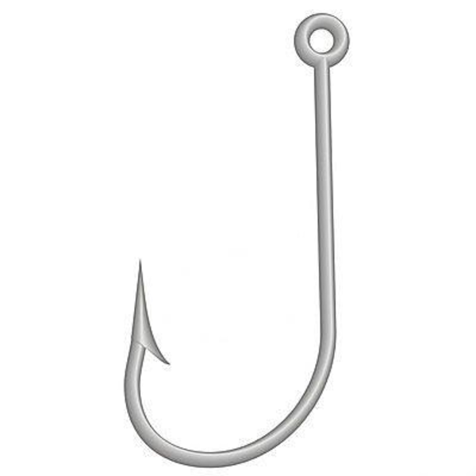

# file-hook

Very lightweight Rust webhook for notifications on creation of files / folders.

### What is file-hook?

file-hook will wait indefinetely and send a request to a specified endpoint for every file or folder recieved, this will contain a key of 'file' or 'folder' and value of corresponding name. It's fast and lightweight so you can leave it running as a background task or in a persistent container.

### How to use

To run:
`cargo run` or `cargo build --release`, then `./file-hook`
 
 

### Environment variables

**ENDPOINT**="https://apimocha.com/test/example"  
Endpoint to sent REST request to on file/folder arrival.

**REQUEST_SENSOR_PATH**="/Users/me/files-to-watch"  
Folder to watch for new files/folders.

**RECURSIVE_MODE**=True  
Notify of recursive events (events inside folders recursively), defaults to false
